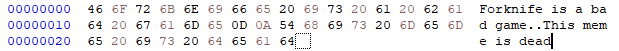

# CPO (CoPy at Offset) 1.0

### Building

Only the windows binaries are available in the [Releases](https://github.com/Hugo4IT/CPO/releases/), so you'll have to build the mac and linux versions yourself. To do that, install [rust](https://rustup.rs/), afterwards, clone the repo and open a terminal in the root folder and run:

```bash
cargo build --release
```

You can now copy the executable (The rest is unnecessary garbage) from `<ROOT>/target/release` to your preferred location and add it to PATH.

You can also directly run the tool, if you want that for some reason. Open the terminal in the root directory once again but this time run:

```bash
cargo run -- ARGUMENTS HERE
```

### Example

This tool extracts data from a file between two hexadecimal offsets. See this example, we have this text file:

```txt
Forknife is a bad game
This meme is dead
```

Looking in a hex editor we can see that the word `game` is at hex `00000012` to `00000015`.



So we can execute this command:

```bash
cpo test/text.txt 00000012 00000015
```

This will result in:

```txt
game
```

To output the result to a text file add ` > output.txt` to the command like this:

```bash
cpo test/text.txt 00000012 00000015 > output.txt
```

While this doesn't look very useful with such a small example, extracting huge chunks from point to point can be frustrating, thus this tool.